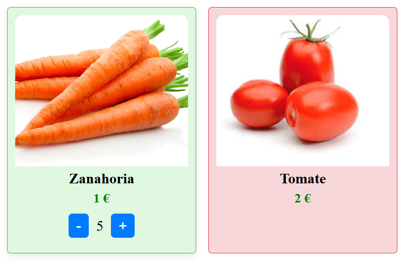

1. **¿Cuáles son los style encapsulation de los componentes? Pon un ejemplo de uso de cada uno de ellos.**
- Emulated: es el comportamiento estándar de Angular. Por ejemplo si lo queremos aplicar a nuestro proyecto, en el archivo article-item.component.css, agregamos un estilo exclusivo para el texto del precio:
```css
.price {
  color: green;
  font-weight: bold;
}
```
En el archivo article-item.component.html, aplicamos también esta clase y vemos que el estilo no afecta a otros componentes que usen la clase price:
```html
<div class="article-item-price price">
    <p>{{product.price}} €</p>
</div>
```

Aquí vemos el color cambiado.


- ShadowDom: permite crear un DOM encapsulado dentro de un elemento, aislado de los estilos y scripts globales de la página. Con esto, conseguimos un aislamiento total del componente.

Para probarlo, modificamos el decorador @Component en article-item.component.ts: 

```typescript
import { ViewEncapsulation } from '@angular/core';

@Component({
    selector: 'app-article-item',
    standalone: true,
    imports: [CommonModule],
    templateUrl: './article-item.component.html',
    styleUrls: ['./article-item.component.css'],
    encapsulation: ViewEncapsulation.ShadowDom // Cambiamos a ShadowDom
})
```  
Creamos un estilo global en `app.component.css` : 
 ```css
 .price {
    color: red; /* Establecemos el color del precio globalmente para ver cómo funciona el ViewEncapsulation.ShadowDom */
  }
  ```
Con esto, si mantenemos el encapsulation: ViewEncapsulation.Emulated, el color del precio se mantendría en rojo, y si lo cambiamos a ViewEncapsulation.ShadowDom se aplica el estilo declarado en el archivo `article-item.component.css` y el precio se ve verde. 

ERROR: El color rojo no se me aplica como estilo global al definirlo en `app.component.css`. Defino la teoría de cómo debería funcionar. 

- None: Con esto, Angular elimina el aislamiento del componente, haciendo que los estilos definidos en el archivo CSS del componente se conviertan en globales y afecten a toda la aplicación.

Para probarlo, cambiamos el encapsulation a `None`:  
```typescript
import { ViewEncapsulation } from '@angular/core';

@Component({
    selector: 'app-article-item',
    standalone: true,
    imports: [CommonModule],
    templateUrl: './article-item.component.html',
    styleUrls: ['./article-item.component.css'],
    encapsulation: ViewEncapsulation.None // Cambiamos a None
})
```  

Con esto, los estilos definidos en `article-item.component.css` ahora se aplican globalmente. 


2. **¿Qué es el shadow DOM?**

El shadow DOM es una técnica que nos permite crear un DOM aislado dentro de un componente. De esta forma, los estilos y el comportamiento de ese DOM no se ven afectados por el resto de la aplicación, lo que nos da un control total sobre el componente. 
Esto es útil cuando necesitamos encapsular completamente los estilos y evitar que se filtren a otros elementos de la aplicación.


3. **¿Qué es el changeDetection?**

El change detection es un mecanismo que Angular usa para comparar el estado actual de la aplicación con el estado anterior, y saber así si algo ha cambiado y actualizar la vista de manera eficiente y automática.

4. **¿Qué diferencias existen entre las estrategias Default y OnPush? ¿Cuándo debes usar una y otra? Ventajas e inconvenientes.**
En Angular, cuando un componente cambia, el sistema de change detection puede revisar toda la aplicación o solo ciertos componentes. Aquí es donde entran las estrategias Default y OnPush:

- Default: Esta es la estrategia por defecto de Angular. Con esta estrategia, Angular revisa todos los componentes cada vez que ocurre un cambio en cualquier parte de la aplicación. Esto es útil para la mayoría de los casos ya que se actualiza todo automáticamente, pero puede ser ineficiente si tienes muchos componentes y muchos cambios, lo cual puede hacer que la aplicación se vuelva lenta.
- OnPush: Esta estrategia es más eficiente. Solo revisa un componente si algo ha cambiado en ese componente (por ejemplo, si cambian las propiedades que recibe, como el precio de nuestro producto Zanahoria). Es decir, solo se actualiza cuando es necesario.

5. **Explica con detalle el ciclo de vida de los componentes. Haz hincapié en cuándo se disparan los hooks OnChanges, OnInit, AfterViewInit y OnDestroy, puesto que son los más utilizados.**

En Angular, los componentes no solo existen, sino que tienen un ciclo de vida. Este ciclo tiene varias fases, que nos permiten ejecutar código en momentos específicos. Los hooks son funciones que se ejecutan automáticamente en diferentes momentos del ciclo de vida de un componente. Importante, los hooks deben implementarse dentro de la clase del componente o directiva.

Los más importantes son:

- OnChanges: Se ejecuta cuando cambian las propiedades de entrada de un componente. Por ejemplo, si el precio de uno de nuestros productos cambia, el hook OnChanges se ejecutará para que el componente pueda reaccionar al cambio.
    - ngOnChanges(): Se usa para reaccionar a cambios en los @Input().

- OnInit: Este hook se ejecuta una vez cuando el componente se ha inicializado. Aquí es donde podemos poner código que deba ejecutarse solo una vez, por ejemplo, para cargar datos desde una API.
    - ngOnInit(): Se usa para configuraciones iniciales.

- AfterViewInit: Este hook se ejecuta después de que Angular haya renderizado la vista completa del componente, es decir, después de que todos los elementos HTML dentro del componente hayan sido creados. Aquí podemos acceder a los elementos del DOM (por ejemplo, un input o un button) y trabajar con ellos.
    - ngAfterViewInit(): 

- OnDestroy: Este hook se ejecuta justo antes de que Angular destruya el componente. 
    - ngOnDestroy(): Se usa para limpiar recursos, como suscripciones o listeners.


Estos hooks nos ayudan a gestionar la lógica de nuestros componentes de manera eficiente y en el momento adecuado, optimizando el rendimiento y evitando problemas de sincronización.
