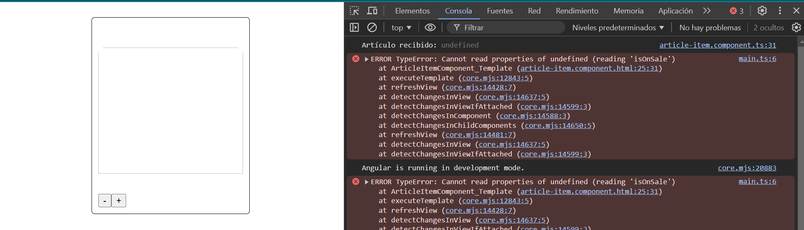
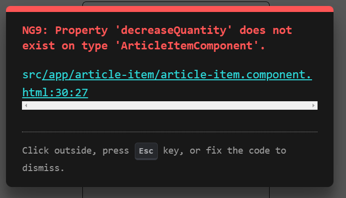

Martro23

Marta Rodrigo

Por aquí recojo un resumen de los problemas que me he encontrado durante la práctica de Angular

### **Estructura de Archivos y Nomenclatura en Angular**
   Al principio me costó entender la arquitectura de archivos y la nomenclatura que Angular utiliza, especialmente porque nunca había trabajado con esta estructura. La organización de los archivos y carpetas, como `app.module.ts` para los módulos y `app.component.ts` para los componentes principales, fue algo nuevo para mí.

### **Decoradores y Angular CLI**
   Otro aspecto que me resultó confuso fue el uso de los **decoradores** y cómo se crean los componentes e interfaces con el comando `ng generate` de Angular CLI. No entendía bien qué eran los decoradores ni cómo Angular los utiliza para configurar los componentes y módulos.

### **Vinculación de Datos y Clases Dinámicas en HTML**
   La vinculación de datos entre los componentes y la vista fue otro desafío, especialmente entender cómo utilizar `[]` para las propiedades y `{{}}` para la interpolación de texto en el HTML. Las **clases dinámicas** y su aplicación en el HTML también me costaron al principio, ya que no entendía bien cómo se reflejaban en la vista.

### **Hooks del Ciclo de Vida**
   Los **hooks del ciclo de vida** de Angular, como `ngOnInit`, `ngOnChanges` y `ngOnDestroy`, me resultaron difíciles de comprender al principio. Estos hooks son importantes para controlar el comportamiento del componente en diferentes momentos de su existencia, pero no entendía bien cuándo o cómo utilizarlos adecuadamente.

### **Encapsulación de Estilos**
   Un desafío importante fue entender cómo funciona la **encapsulación de estilos** en Angular, en particular la diferencia entre `ViewEncapsulation.Emulated` y `ViewEncapsulation.ShadowDom`. Al principio, no comprendía cómo los estilos globales interactúan con los estilos encapsulados dentro de los componentes, lo que generó algunos errores, especialmente cuando intentaba aplicar estilos globales a componentes con Shadow DOM.


### **Problema en el ejercicio 7**  
Aunque todo parecía estar bien planteado, encuentro problemas en el ejercicio 7 y el bucle `*ngFor`, ya que no estaba renderizando correctamente los artículos en la vista. 

He intentado gestionarlo y solucionarlo de diferentes formas, como intentar usar `trackBy` en el html del article-list, he intentado imprimir por pantalla los detalles del error por el cual no se renderiza usando: 

 ```typescript
 ngOnInit() {
    console.log('Artículo recibido:', this.article);
  }
  ```

 Con esto en la consola observo que el artículo me lo detecta como undefined. 
 
 

 Después de intentar lo que he podido, no encuentreo el motivo de que no me renderice la información. 
 
 Además, también quería destacar que aunque tenía que cambiar la lógica de incremento y decremento, moviéndola de article-item al componente article-list, si las quitaba también me salía error: 




Por ello, prefiero dejarlo así y esperar a la corrección del profesor porque siento que si continúo con esto voy a liarme más. 

### **Solución ejercicio 7**
Después de darle varias vueltas a los errores del ejercicio 7, conseguí identificar qué estaba fallando y aplicar algunos cambios que solucionaron el problema del renderizado y la lógica entre los componentes.

Primero, ajusté el app.component para que apuntara directamente a article-list, asegurándome de que la aplicación cargara bien el componente principal y no se quedara en blanco. También eliminé varios imports en los componentes article-item y article-list que no correspondían y que creo que estaban creando conflictos. Al dejarlos más limpios, todo empezó a fluir mejor.

Por último, modifiqué el HTML de article-list para que pudiera recoger correctamente el evento que venía de article-item. Gracias a esto, ya funciona la lógica de incremento y decremento después de haberla trasladado al lugar correcto.

Con estos cambios, conseguí que los artículos se rendericen como esperaba y desaparecieron los errores de undefined. 